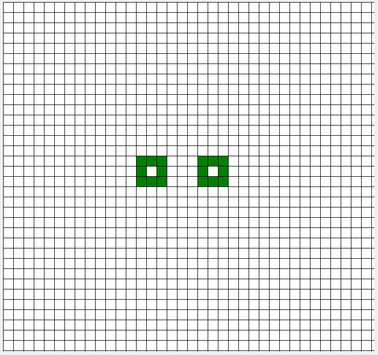
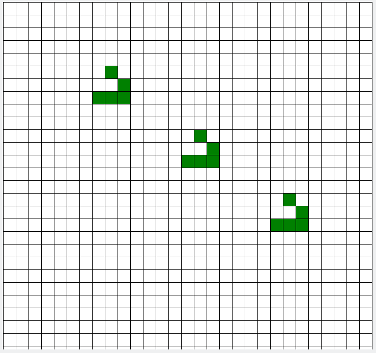

# Conway's Game of Life

[](https://www.python.org/downloads/release/python-380/)

Simple implementation of the Conway's Game of Life

## Some gifs

Pulsar                  |  Glider
:----------------------:|:-------------------------:
  |  

## Running the game

```
$ pip3 install -r requirements.txt
$ python3 main.py
```